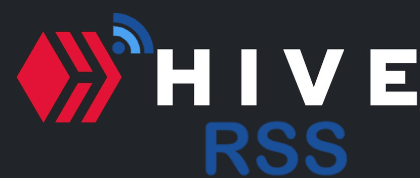

<title>hiveRSS</title>

# HiveRSS [https://hiverss.com](https://www.hiverss.com)

A simple tool for creating Atom/RSS feeds from Hive accounts and categories.

Go to (almost) any Hive page with a content stream, and replace 'hive.blog' with 'hiverss.com' in the URL. 

https://hive.blog/trending/hive -> https://hive***rss***.com/trending/hive

## Usage Examples

### User Feed

Get posts from your feeds or others' as well.

> `hiverss.com/@<username>/feed`

* [hiverss.com/@philipkoon/feed](https://hiverss.com/@philipkoon/feed)

### Posts By Author

Get posts from your favorite hiver.

> `hiverss.com/@<username>/blog`

* [hiverss.com/@philipkoon/blog](https://hiverss.com/@philipkoon/blog)

Filter posts to show only posts matching a tag

> `hiverss.com/@username?tagFilter=tag`

* [hiverss.com/@sajannair?tagFilter=travel](https://hiverss.com/@sajannair?tagFilter=travel)

### Comments By Author

Get comments from your favorite hiver.

> `hiverss.com/@<username>/comments`

* [hiverss.com/@ned/comments](https://hiverss.com/@ned/comments)

### Posts by Category

Get posts by category, you can get posts by new/hot/trending/promoted

> `https://hiverss.com/new/<category>` OR `https://hiverss.com/created/<category>`
> `https://hiverss.com/hot/<category>`
> `https://hiverss.com/trending/<category>`
> `https://hiverss.com/promoted/<category>`

* [https://hiverss.com/new/ethereum](https://hiverss.com/new/ethereum)
* [https://hiverss.com/hot/bitcoin](https://hiverss.com/hot/bitcoin)
* [https://hiverss.com/trending/steem](https://hiverss.com/trending/steem)

### Posts Voted by a Specific User

Get a feed of links to posts recently voted by a user

> `https://hiverss.com/@<username>/votes`

* [https://hiverss.com/@ocdb/votes](https://hiverss.com/@ocdb/votes)

Only include votes above a specific percentage weight, and link to non-default interace

> `https://hiverss.com/@<username>/votes?minVotePct=<percentage>&interface=<interface-name>`

* [https://hiverss.com/@ocdb/votes?minVotePct=100&interface=peakd](https://hiverss.com/@ocdb/votes?minVotePct=100&interface=peakd)

## Supported Hive Frontends 

Use with the query parameter 'interface'. See examples below.

* Hive.blog (default) `https://hiverss.com/@<username>`
* PeakD.com `https://hiverss.com/@<username>?interface=peakd`
* Ecency.com `https://hiverss.com/@<username>?interface=ecency`
* LeoFinance.io `https://hiverss.com/@<username>?interface=leofinance`
* Hivelist.org `https://hiverss.com/@<username>?interface=hivelist`
* Ctptalk.com `https://hiverss.com/@<username>?interface=ctptalk`
* Splintertalk.io `https://hiverss.com/@<username>?interface=splintertalk`
* Reggaejahm.com `https://hiverss.com/@<username>?interface=reggaejahm`
* Sportstalksocial.com `https://hiverss.com/@<username>?interface=sportstalk`
* Weedcash.network `https://hiverss.com/@<username>?interface=weedcash`
* Hivehustlers.io `https://hiverss.com/@<username>?interface=hivehustlers`
* Naturalmedicine.io `https://hiverss.com/@<username>?interface=naturalmedicine`
* Dunksocial.io `https://hiverss.com/@<username>?interface=dunksocial`
* WeAreAliveAnd.social `https://hiverss.com/@<username>?interface=wearealive`
* MusicForLife.io `https://hiverss.com/@<username>?interface=musicforlife`
* Beatzchain.com `https://hiverss.com/@<username>?interface=beatzchain`
* Blocktunes.social `https://hiverss.com/@<username>?interface=blocktunes`

## Contributors

* Creator of SteemRSS: [@philipkoon](https://hive.blog/@philipkoon)
* SteemRSS Contributor: [@doriitamar](https://hive.blog/@doriitamar)
* HiveRSS Maintainer: [@torrey.blog](https://hive.blog/@torrey.blog)
* HiveRSS Maintainer: [@hivetrending](https://hive.blog/@hivetrending) Twitter: [@HiveTrending](https://twitter.com/hivetrending)